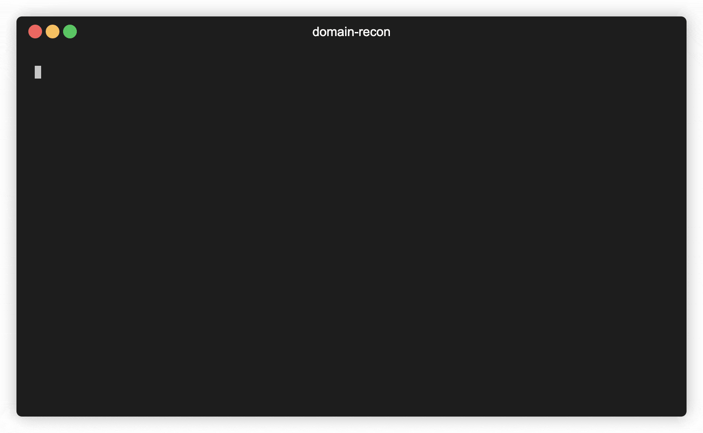

# domain-recon-rs

## Intro

`domain-recon-rs` is a tool which can be used for passive host reconnaissance. It helps extend the attack surface by
fetching all the available active certificates for the host. Using certificate parsing, it extracts
all available domains from "Common Name" and "Matching Identities" fields.
Moreover, in a lot of cases, it may encounter certificates issued for wildcard domains (example: `*.example.com`).
For these domains, it can use a word list to extend these wildcards by filling in words from the list and generate
potential subdomains.

For more information, please read the blogpost: [https://ervinszilagyi.dev/articles/certificate-parsing-with-domain-recon](https://ervinszilagyi.dev/articles/certificate-parsing-with-domain-recon)

### Example of usage:

```bash
domain-recon -d wikipedia.org -f words.txt
```



Currently, certificates are fetched from [crt.sh](https://crt.sh/) and [censys](https://search.censys.io/api). By default,
`domain-recon` will use crt.sh only, censys being an additional option. In order to use censys, we have to provide a 
configuration file, that contains our API token and a password. `domain-recond` reads this information from 
the `$HOME/domain-recon/config.json` folder. The structure of this file should be as follows:

config.json
```json
{
    "censys": [
        {
            "app-id": "84f2fe92-9c4e...",
            "secret": "bmwjq...."
        }
    ]
}
```

### All the Arguments

```bash
Extract domains and subdomains from certificates.

Usage: domain-recon.exe [OPTIONS] --domain <DOMAIN>

Options:
  -d, --domain <DOMAIN>
          Domain name to be scanned
  -f, --file <FILE>
          Words file for extending wildcard domains [default: ]
  -p, --plain
          Display results in plain form
      --csv
          Save output to csv
      --use-system-resolver
          Use default system resolver
      --dns-resolver <DNS_RESOLVER>
          Specify DNS resolver. Allowed values are: google, cloudflare, quad9. Default is google Can contain multiple values delimited by comma, ex --dns-resolver="google,cloudflare,quad9" [default: google]
      --provider <PROVIDER>
          Certificate provider. Allowed values are: certsh, censys. Default is certsh Can contain multiple values delimited by comma, ex --provider=certsh,censys [default: certsh]
  -c, --config <CONFIG>
          Path to config file
  -h, --help
          Print help information
  -V, --version
          Print version information
```

## Building the Project

This project requires Rust 1.64 or above.

```bash
cd domain-recon-rs
cargo build --release
```
